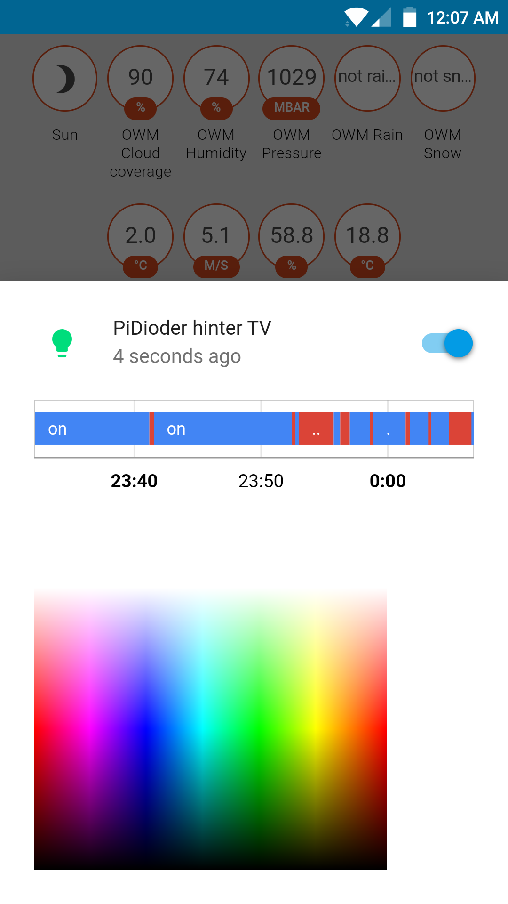

# ha-light-dioder

A Home Assistant ([code on Github](https://github.com/home-assistant/home-assistant)
component for interfacing with the IKEA Dioder LED system.

## Hardware setup
This code assumes the a setup using the following parts:
* Raspberry Pi (here: Model B+ or newer)
* Adafruit (or similar, e.g. SunFounder) PCA9685 12xPWM driver for I2C
* ULN2003 Transistor array for accessing the Dioder's 12V supply

Similar to [this Fritzing project](http://fritzing.org/projects/ikea-dioder-hack),
we replace the Dioder's controller entirely. 

Here's a short description of the setup: The PCA9685 is coupled to the Raspberry Pi
via its native I2C interface; SDA/SDC on the PCA9685 board are connected
to SDA.SDC of the ULN2003. On its output side, we connect the pins from
DIODER's 12V supply for GND and V+ as well as the pins for R, G, B (in that
order) to the ULN outputs 0 - 2 (photo to come).

## Software setup
To get the I2C bus running, the following steps have to be taken (for
Home Assistant's Python VENV):
* Install ``python3-dev libi2c-dev``
* Add user homeassistant to group ``i2c``
* Inside of the HA Pip environment, build and install python3-smbus from ``https://github.com/tkurbad/python3-smbus``

## Installation
Assuming the HA/SW setup from above, moving the included ``pidioder.py`` to
``/home/homeassistant/.homeassistant/custom_components/light/`` includes
the component (assuming an All-in-One HA installation).

Then, add the following lines to your ``configuration.yaml``:
```
light:
    platform: pidioder
    name: My PiDioder
```
Naturally, the name is up to your choice!

That's it! If everything has worked out, you should have the following interface
on your HA state screen:

